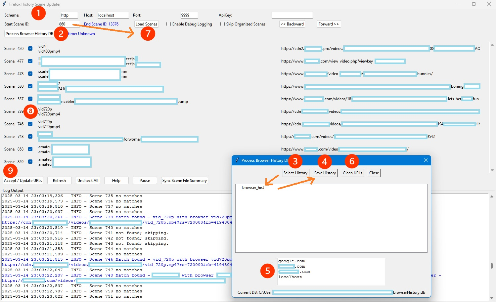

# urlstashgui
Use your browser history to find URL matches for scenes in StashApps
## Requirements (built and tested on...)
- StashApps
- Browser history
  --e.g. Mozilla %APPDATA%\Mozilla\Firefox\Profiles \<your profile>\**places.sqlite**
  -- or Chrome %LOCALAPPDATA%\Google\Chrome\User Data\Default \**History**
- scenes with filenames that match the URL title in history
 - .mp4, -01, -02/etc, and any non-alphanumeric character will be ignored, including spaces.

-Note: when you are done don't forget to scan your updated scenes with their URLs.
 --Go to Tags, in the searchbox enter: urlhistory
 --Click urlhistory, then choose the tagger button on the right side of the search/filter menu
 --Source: Scrape with URL
 --Use a brain cell of attention to skip performers with made up names
 

## Using the app
1. open python file (yaml file editing is optional)
2. edit StashApp connection info if needed
  - APIKEY is listed in http://localhost:9999/settings?tab=security if you have this feature enabled
3. click "Copy places.sqlite" and browse to your Mozilla profile. Select places.sqlite.
  - This file is then copied to the desktop. Your actual browser history is not modified.
4. click "Load Scenes". This connects to your StashApps and will populate your max Scene ID # and begin searching.
5. it searches until it finds 10 scenes then shows the results. uncheck scenes you dont want updated. 
  - any existing URLs for your scenes are never modified. identical URLs are skipped automatically and will not appear as a result.
6. click Accept / Update URLs when you are ready to have the scene's URLs updated to stashapps.
7. skip all scene matches by clicking Forward >> or uncheck all/manually unchecking all scenes.
8. search by scene id (skip around...) by entering a scene id in the Start Scene ID box. it doesn't matter if you have a scene id with that #
